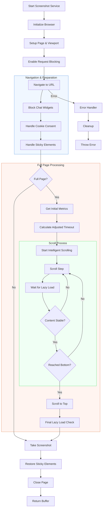

<h3 align="center"> Shawty </h3>

<p align="center">It makes your screenshots go brrrrrrr</p>

A no-BS screenshot service running on Cloudflare Workers that simply works. Built because we were tired of paying premium for dollar store screenshots. Webhooks included, because obviously.

## Features That Slap

* Actually works in prod (we were surprised too)
* Captures full page screenshots (because who has time to scroll)
* Blocks ads (who needs those anyway)
* Smart enough to handle sticky elements (they're not going anywhere)
* Supports multiple formats (because we're not monsters)
* Configurable quality (because you're a perfectionist)
* Works with most of the websites (because we're not picky)
* Automatically handles those pesky cookie popups (goodbye, GDPR lmao)
* Yeets everything into Cloudflare R2 (because we're all about that edge)
* Sends webhook notifications (because you're too busy to check)

## Quick Start

```typescript
import { ScreenshotService } from 'shawty';

// The bare minimum (like your CI setup)
const screenshot = await screenshotService.takeScreenshot({
  url: 'https://example.com',
});

// The whole shabang 
const fancyScreenshot = await screenshotService.takeScreenshot({
  url: 'https://example.com',
  width: 1920,          // wider than your monitor
  height: 1080,         // taller than your attention span
  fullPage: true,       // capture ALL the things
  format: 'jpeg',       // because pngs are so 2020
  quality: 80,          // good enough for The Gram™
});
```

## Environment Variables (the secret sauce)

```env
R2_BUCKET_NAME=your-bucket-name
WEBHOOK_URL=https://your-webhook.com/endpoint
```

## Installation

```bash
npm install shawty
# you now have commitment issues and a screenshot service
```

## Core Components

### 1. ScreenshotService

The main service class that orchestrates the screenshot process:

```typescript
const screenshotService = new ScreenshotService();
await screenshotService.takeScreenshot({
  url: "https://example.com",
  fullPage: true,
  timeout: 30000
});
```

### 2. PageManager

Handles page-specific operations through several specialized modules:

#### a. Sticky Element Handler
- Identifies and manages fixed/sticky positioned elements
- Prevents elements from interfering with full-page screenshots
- Restores original styles after capture

#### b. Chat Widget Blocker
- Blocks common chat widget domains (HubSpot, Intercom, Crisp, etc.)
- Uses request interception to prevent widget loading
- DOM-based blocking with MutationObserver for persistence

#### c. Intelligent Scrolling System
- Adaptive scroll steps based on viewport size
- Monitors page stability and content loading
- Handles dynamically loaded content
- Built-in timeout management

#### d. Lazy Load Detection
- Tracks image and iframe counts
- Monitors network requests
- Ensures content stability before capture

## Process Flow

1. **Initialization**
   ```typescript
   // Initialize with cookie consent rules
   const service = new ScreenshotService();
   ```

2. **Page Setup**
   - Creates new page with specified viewport
   - Sets up request interception
   - Configures timeout settings

3. **Navigation & Preparation**
   - Blocks chat widgets
   - Handles cookie consent
   - Manages sticky elements
   - Waits for initial page load

4. **Content Loading**
   ```typescript
   // Metrics tracked:
   interface LazyLoadMetrics {
     imageCount: number;      // Total images
     iframeCount: number;     // Total iframes
     pendingNetworkRequests: number;
   }
   ```

5. **Scrolling Process**
   - Calculates optimal scroll step (80% of viewport)
   - Monitors document height changes
   - Waits for content stabilization
   - Handles dynamic loading

6. **Screenshot Capture**
   - Adjusts timeout based on page length
   - Performs final stability check
   - Captures full page
   - Restores page state

## Deep Dive

### Overview
Here's a quick rundown of the core flow:




### Cookie Consent Handling
- Uses DuckDuckGo's autoconsent library
- Handles multiple consent management platforms
- Automatic opt-in for cookie dialogs

### Chat Widget Blocking
```typescript
const blockPatterns = [
  "crisp.chat",
  "intercom.io",
  "messenger.com",
  // ... more patterns
];
```
- Domain-based blocking
- Style-based hiding
- Mutation observation for persistence

### Intelligent Scrolling
```typescript
interface ScrollMetrics {
  viewportHeight: number;
  documentHeight: number;
  scrollTop: number;
}
```
- Adaptive scroll steps
- Content stability monitoring
- Dynamic timeout adjustment


## Contributing

Found a bug? Fixed a thing? Made it better? Let's hear it!
* Fork it
* Branch it
* Push it
* PR it

## Release Notes

Built with 🤍 and an unhealthy amount of caffeine.

Part of the "services we built because we had more grit than cash" collection.
